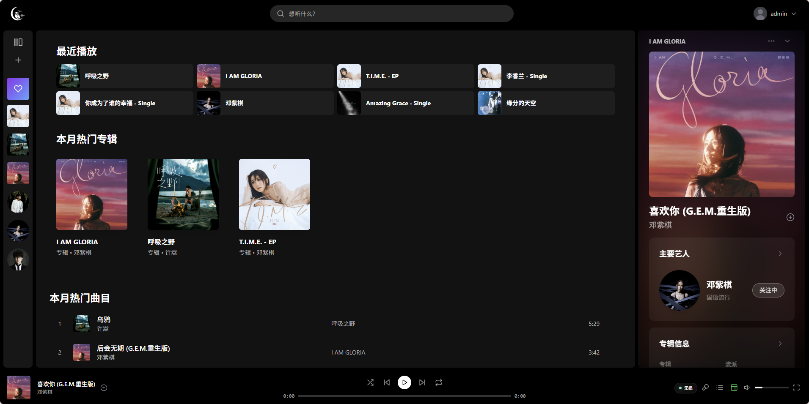
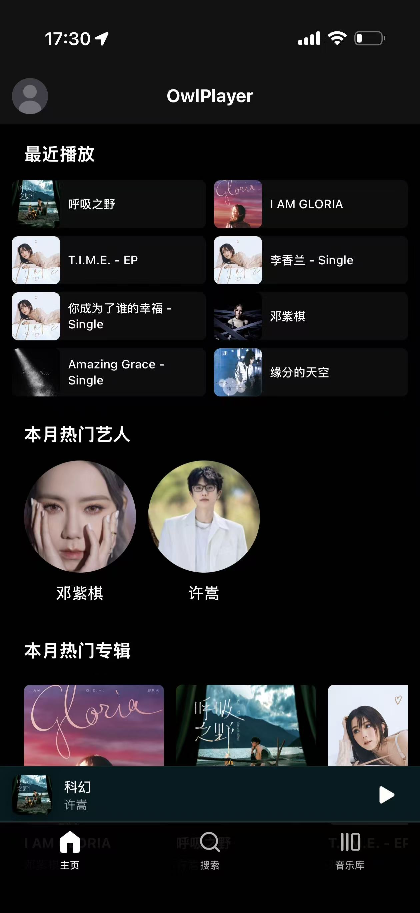

# OwlPlayer

> NAS / 家庭服务器自托管的本地音乐流媒体播放器，Spotify 风格的响应式 Web 界面。

OwlPlayer is a self-hosted music streaming app for your local library. It scans your audio files into PostgreSQL, serves them via direct Range requests or HLS, and presents a Spotify-like UI on desktop and mobile (PWA). Apple Music is supported as an **optional** metadata/lyrics enhancement source — never as a streaming source.

> ⚠️ **当前状态**：v0.1.0 早期预览版。API 与数据结构可能在 1.0 之前发生破坏性变更。
> OwlPlayer 目前尚未完成生产级安全加固（not production hardened），请优先在受信任的家庭网络 / NAS 环境中部署；如需公网访问，请自行配置 HTTPS、反向代理访问控制、备份与监控。

## 截图





## 功能

- 🎵 本地音频扫描与索引（FLAC / ALAC / M4A / MP3 等）
- 🎧 直接 Range 播放 + 可选 HLS（iOS PWA 后台兼容）
- 📱 桌面 + 移动端响应式布局，PWA 可安装
- 🔐 多用户 JWT 认证、邮箱验证、密码重置
- 📥 离线下载，可选音质（IndexedDB + SW 缓存）
- 🎤 歌词同步显示（TTML 逐字 / LRC 行级）
- 👤 用户库：收藏歌曲 / 专辑 / 歌单 / 关注艺人 / 播放历史
- ⚙️ 首次启动 Web 向导，无需手改配置文件
- 🛠 管理后台：用户、扫描、刮削、邮件、运行期设置

## 快速开始（Docker）

```bash
git clone https://github.com/OwlCt/OwlPlayer.git
cd OwlPlayer
cp .env.example .env
# 至少设置：
#   MEDIA_ROOT_HOST=/path/to/your/music
#   SETUP_BOOTSTRAP_TOKEN=<随机字符串>
#   JWT_SECRET=<随机密钥>
docker compose up -d --build
```

打开 `http://localhost:8080/setup`，输入 `SETUP_BOOTSTRAP_TOKEN`，按向导完成：

1. 数据库连接确认
2. 创建首个管理员账户
3. 配置本地媒体库根目录、扫描模式
4. （可选）配置 SMTP 邮件 / Apple Music 元数据增强

## 本地开发

需要 Go 1.25.9+、Node 22+、PostgreSQL 14+。

```bash
# 后端
cp config.yaml.example config.yaml      # 至少填好 database 与 jwt
go run .

# 前端
cd frontend
npm install
npm run dev
```

默认地址：API `http://localhost:8080`、前端 `http://localhost:3000`（已配置 `/api` 代理）。

## 当前限制

- 仅支持 PostgreSQL，不支持 SQLite / MySQL
- 音频文件需在服务进程可读路径，不内置远程挂载（请在 NAS / 容器层挂载 SMB/NFS/WebDAV）
- 暂未支持 ReplayGain、音频均衡器、跨设备播放队列同步
- 暂未提供二进制发行包，需自行构建
- iOS PWA 后台播放在 Safari 多 PWA 共存时存在系统层音频会话冲突（详见相关 issue）
- 仅有可选 Apple Music 元数据增强；尚未集成 MusicBrainz / Last.fm / TheAudioDB 等开放数据源

## ⚖️ Apple Music 元数据增强 ─ 法律声明

仓库中的 `utils/ampapi/` 模块通过 Apple Music 公开 catalog API 抓取元数据与歌词，用于丰富本地音乐索引。**这是可选功能，默认在首次启动向导中保持关闭**，不开启时所有播放、媒体库、搜索功能均正常工作。

启用之前请知悉：

- 该模块通过解析 Apple Music 网站前端 JS 提取访问 token，与 Apple 官方开发者授权流程不同；
- 同步歌词功能需要您本人 Apple Music 账户的 `media-user-token`，是否符合您所在司法辖区下的服务条款由您自行判断；
- 项目维护者不为启用该模块所产生的任何法律或合规风险负责；
- 计划在 v0.2 中将 `utils/ampapi/` 拆分为独立可选构建标签（`-tags apple_music`），默认编译产物不再包含；
- 请勿向上游仓库提交对 Apple Music API 行为更深耦合的 PR（见 [CONTRIBUTING.md](CONTRIBUTING.md)）。

如果您只需要纯本地播放，**保持默认设置即可**，可以跳过该章节。

## 文档

- 贡献指南：[CONTRIBUTING.md](CONTRIBUTING.md)
- 安全漏洞上报：[SECURITY.md](SECURITY.md)

## License

[AGPL-3.0](LICENSE) © OwlPlayer contributors.

> 注：AGPL 要求即使以网络服务方式提供 OwlPlayer，您也必须向最终用户提供完整对应源代码。如该条款不适合您的部署场景，请勿使用本项目。
